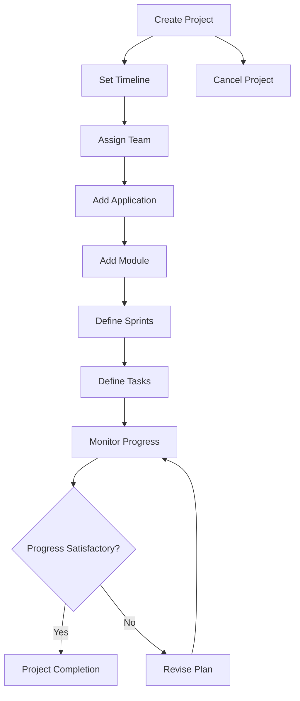
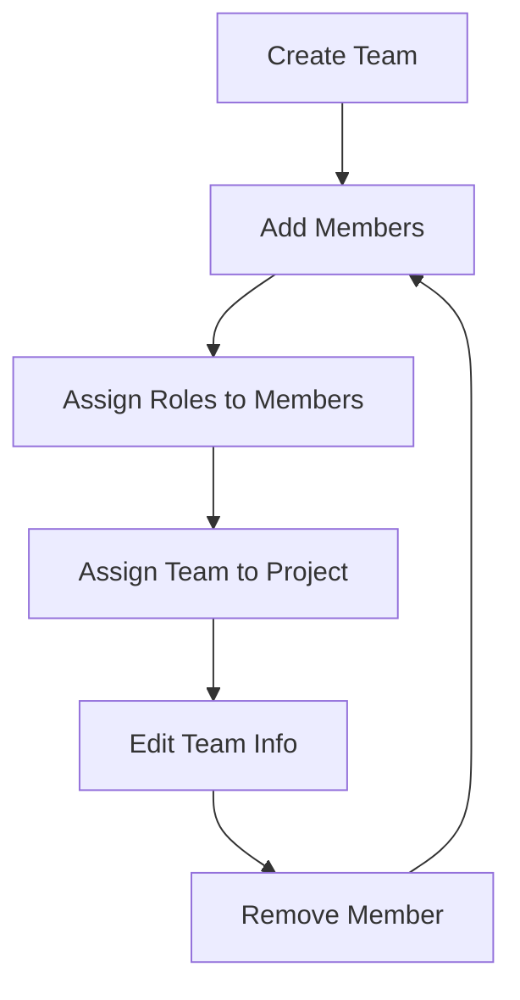
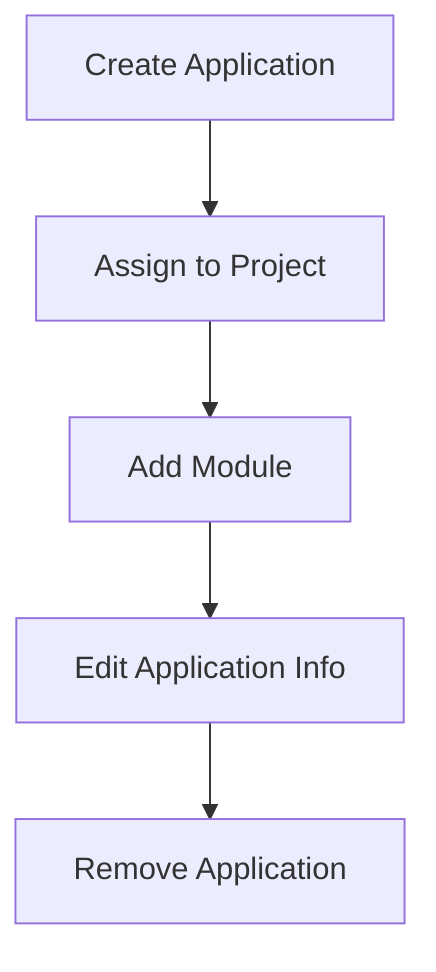
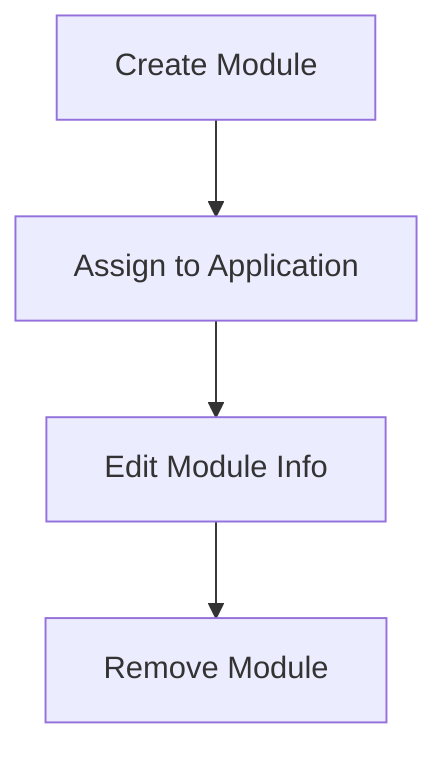
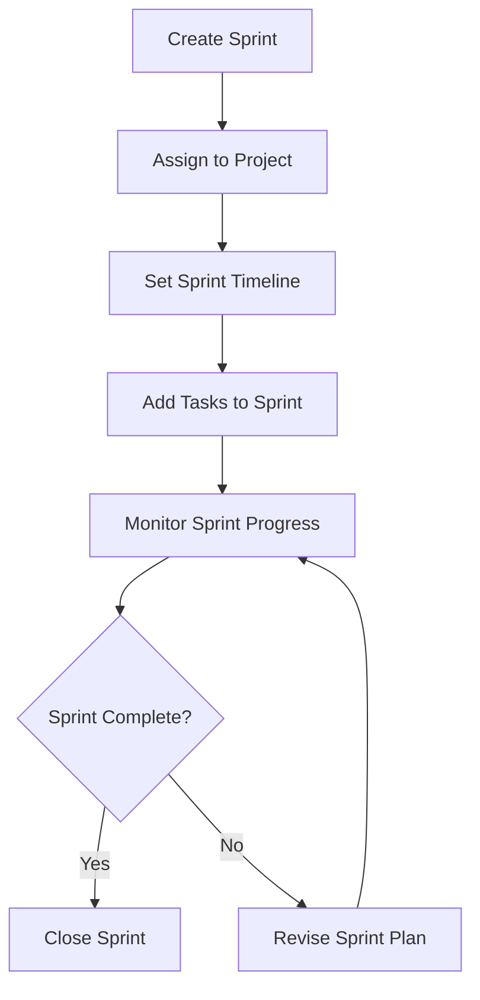
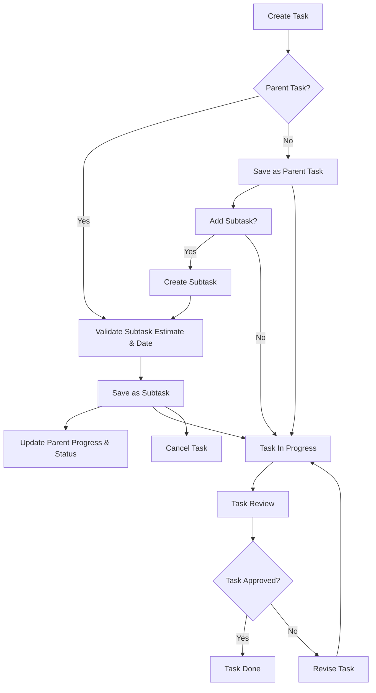
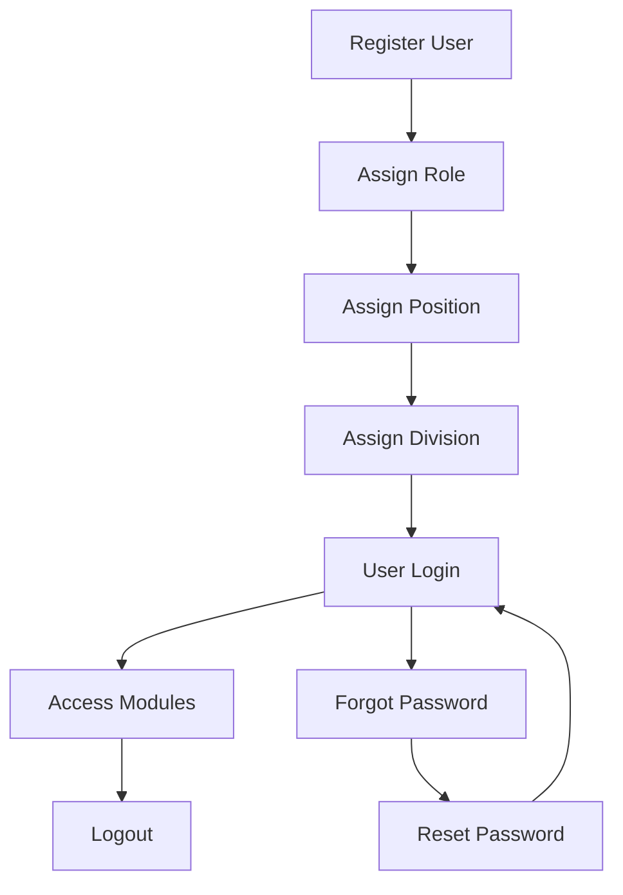
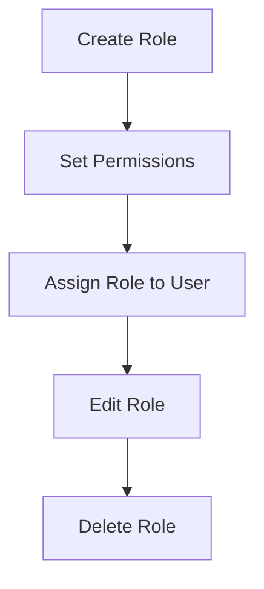
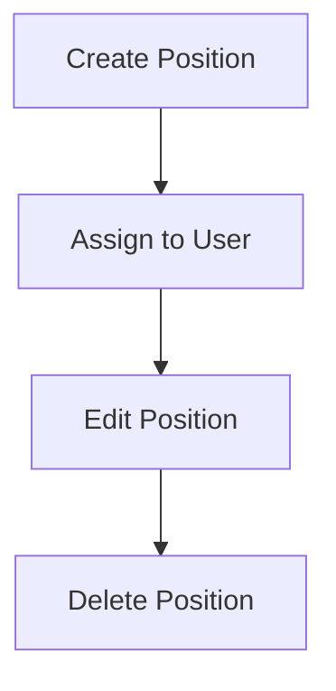
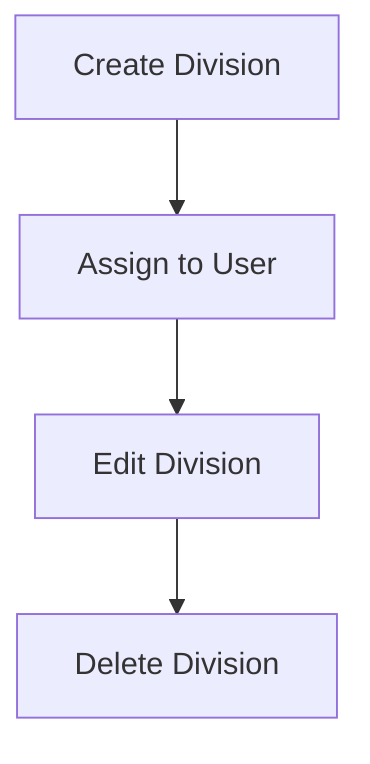

# Flow Diagram Modul Project Management

---

## Modul: Project

---

## Modul: Team

---

## Modul: Application

---

## Modul: Module

---

## Modul: Sprint

---

## Modul: Task

---

## Modul: User

---

## Modul: Role

---

## Modul: Position

---

## Modul: Division

